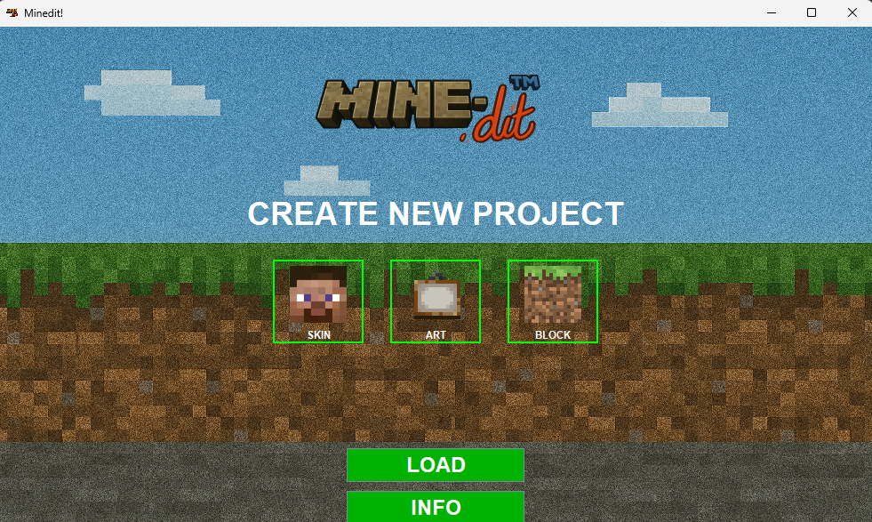
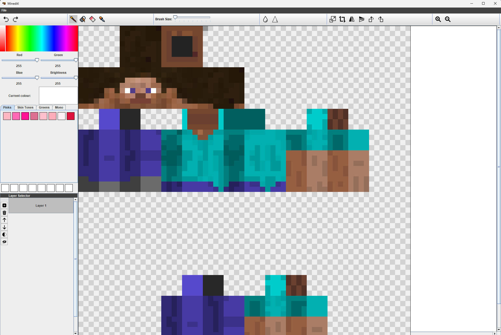
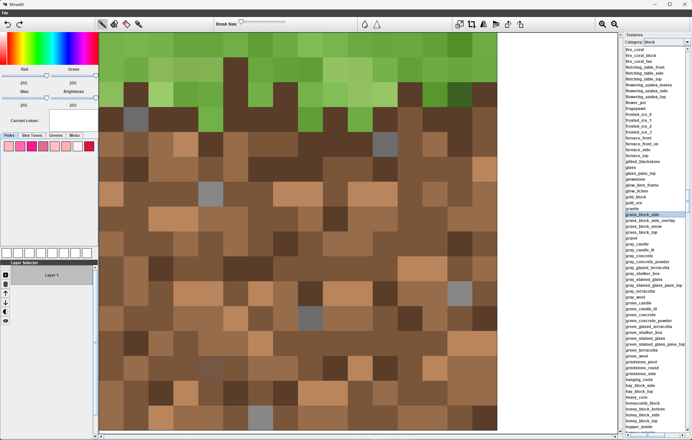
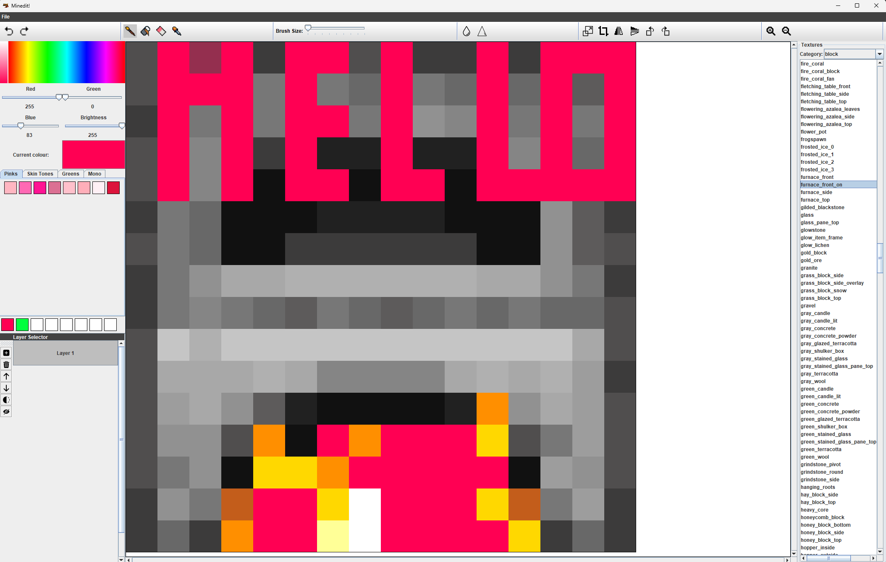
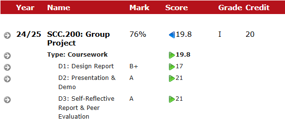

# MinedIt - Advanced Minecraft Pixel Editor 🎨⛏️

[](https://www.oracle.com/java/)
[](https://maven.apache.org/)
[](https://github.com)

> **A specialized pixel graphics editor designed for Minecraft content creation**  
> Developed as part of Lancaster University's SCC.200 Group Project (2024/25)

## 🏆 Project Overview

MinedIt is a sophisticated pixel graphics editor specifically tailored for the Minecraft ecosystem. Our team of 6 developers created a powerful yet intuitive tool that addresses the unique needs of Minecraft content creators, achieving an outstanding **First Class grade of 76%**.

### 🎯 Project Goals
- Build a user-friendly pixel editor optimized for Minecraft content
- Support both texture pack editing and custom skin creation
- Provide seamless import/export functionality for Minecraft assets
- Deliver a professional-grade tool with advanced editing capabilities

## ✨ Key Features

### 🎨 **Multi-Mode Editor**
- **Skin Editor**: Create and modify Minecraft player skins with precision
- **Block Texture Editor**: Design custom block textures for resource packs
- **Art Canvas**: Free-form pixel art creation with customizable dimensions

### 🔧 **Advanced Texture Pack Support**
- **Import**: Load existing Minecraft texture packs (ZIP files or folders)
- **Export**: Generate complete Minecraft-compatible resource packs
- **Category Organization**: Browse textures by type (blocks, items, entities, etc.)
- **Live Preview**: Real-time preview of texture modifications

### 👤 **Minecraft Skin Integration**
- Load default skins (Steve, Alex) for quick editing
- Import custom skins from image files
- Maintain proper skin proportions and UV mapping
- Export skins in Minecraft-compatible formats

### 🛠️ **Professional Editing Tools**
- **Brush Tools**: Various brush sizes and shapes
- **Color Picker**: Advanced color selection with opacity control
- **Layer Management**: Multi-layer editing with visibility controls
- **Zoom & Pan**: Precise editing with variable zoom levels
- **Undo/Redo**: Complete action history management
- **Grid System**: Pixel-perfect alignment assistance

### 📁 **Smart Asset Management**
- Automatic texture discovery and categorization
- Batch operations for multiple textures
- Resource pack structure preservation
- Default Minecraft 1.21.5 texture pack included

## 📸 Screenshots

### Main Menu

*The intuitive main menu offering three editing modes: Skin, Art, and Block editing*

### Skin Editor

*Professional skin editing tools with pixel-perfect precision for Minecraft character customization*

### Block Texture Editor

*Advanced block texture editing with real-time preview and category organization*

### Application Overview

*Complete editing environment showcasing the full feature set and user-friendly interface*

## 🚀 Quick Start

### Prerequisites
- **Java 17+** installed on your system
- **Apache Maven** for project compilation

### Installation & Running
```bash
# Clone the repository
git clone https://github.com/Sufyan123o/LancasterUni-Group-Project.git
cd LancasterUni-Group-Project/pixel-editor

# Compile the project
mvn clean compile

# Run the application
mvn exec:java
```

## 🎮 Usage Guide

### Starting a New Project
1. **Launch MinedIt** - Run the application to see the main menu
2. **Choose Your Mode**:
   - **SKIN**: For creating/editing Minecraft player skins
   - **BLOCK**: For texture pack development
   - **ART**: For general pixel art creation

### Working with Texture Packs
1. **Load a Texture Pack**: File → Load Block Pack
2. **Select Category**: Choose from blocks, items, entities, etc.
3. **Edit Textures**: Use the comprehensive toolset
4. **Export**: File → Export Minecraft Pack to create a new resource pack

### Skin Editing Workflow
1. **Load Base Skin**: Choose Steve, Alex, or import custom
2. **Edit**: Use pixel-perfect tools for modification
3. **Preview**: See changes in real-time
4. **Save**: Export your custom skin

## 🏗️ Technical Architecture

### Core Components
- **`App.java`**: Application entry point and initialization
- **`MainMenu.java`**: Primary interface for project selection
- **`MainWindow.java`**: Main editing environment
- **`CanvasPanel.java`**: Core drawing and rendering engine
- **`BlockEditorWindow.java`**: Texture pack management system
- **`ColorSelector.java`**: Advanced color picking interface
- **`LayerPane.java`**: Layer management system

### Key Technologies
- **Java Swing**: For the comprehensive GUI framework
- **Maven**: Build automation and dependency management
- **BufferedImage**: High-performance image processing
- **ZIP Handling**: Native texture pack import/export
- **File I/O**: Efficient asset management

## 👥 Development Team

**Team Size**: 6 Developers  
**Development Period**: Academic Year 2024/25  
**Course**: SCC.200 Group Project, Lancaster University

### My Contributions
As a core team member, I was responsible for:
- **Architecture Design**: Designed modular code structure and component interactions
- **Texture Pack System**: Implemented complete import/export functionality
- **Minecraft Integration**: Built native Minecraft skin loading and compatibility
- **Core Features**: Developed key editing tools and workflow optimization
- **Quality Assurance**: Ensured robust error handling and user experience

## 🎯 Project Success

### Academic Achievement
- **Grade**: First Class (76%)
- **Recognition**: Outstanding implementation of complex requirements
- **Innovation**: Novel approach to Minecraft-specific pixel editing


*Official grade documentation showing First Class achievement (76%)*

### Technical Accomplishments
- **Cross-Platform Compatibility**: Runs on Windows, macOS, and Linux
- **Performance Optimization**: Efficient memory usage and rendering
- **User Experience**: Intuitive interface designed for content creators
- **Extensibility**: Modular architecture supporting future enhancements

## 📂 Project Structure

```
pixel-editor/
├── src/main/java/g82/           # Core application source
│   ├── App.java                 # Application entry point
│   ├── MainMenu.java           # Main menu interface
│   ├── MainWindow.java         # Primary editing window
│   ├── CanvasPanel.java        # Drawing canvas implementation
│   ├── BlockEditorWindow.java  # Texture pack management
│   ├── ColorSelector.java      # Color selection tools
│   ├── LayerPane.java          # Layer management
│   ├── controllers/            # Business logic controllers
│   ├── managers/               # System managers
│   └── models/                 # Data models
├── src/main/resources/         # Application assets
│   ├── default_pack_1.21.5.zip # Default Minecraft textures
│   ├── steve.png               # Default Steve skin
│   ├── alex.png                # Default Alex skin
│   └── editor-icons/           # UI icons and graphics
└── src/test/java/              # Comprehensive test suite
```

## 🔮 Future Enhancements

- **3D Preview**: Real-time 3D model preview for skins and blocks
- **Animation Support**: Animated texture creation tools
- **Cloud Integration**: Online texture pack sharing platform
- **Plugin System**: Third-party tool integration
- **Version Control**: Built-in project versioning

---

**MinedIt** - *Bringing professional pixel editing to the Minecraft community* 🎨⛏️
